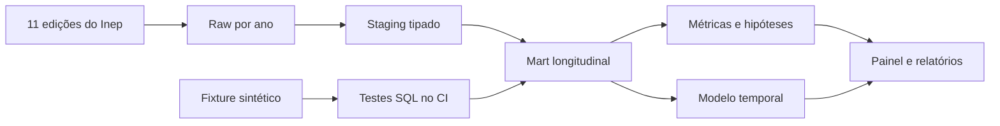

# Demonstração reproduzível

Este roteiro permite avaliar o projeto em poucos minutos ou reconstruir todos
os produtos derivados a partir do PostgreSQL.

## Caminho rápido: avaliar sem baixar os microdados

Os artefatos analíticos finais estão versionados. Os microdados brutos, por
tamanho e licença de distribuição, permanecem fora do Git.

1. Abra [`reports/dashboard/index.html`](../reports/dashboard/index.html).
2. Leia a resposta executiva em
   [`executive_report.md`](executive_report.md).
3. Verifique localmente que os artefatos não foram alterados:

   ```bash
   python -m venv .venv
   python -m pip install -e .
   radar verify-portfolio
   ```

4. Se o navegador bloquear a abertura direta do HTML, sirva a pasta:

   ```bash
   python -m http.server 8000 --directory reports/dashboard
   ```

   Depois acesse `http://localhost:8000`.

O comando de verificação confere tamanho, SHA-256 e conteúdo mínimo de sete
entregas: painel, relatórios, experimentos e documentação.

## Roteiro de cinco minutos

### 1. Comece pelo problema

A oferta passou de 8,1 milhões para 23,7 milhões de vagas entre 2014 e 2024,
mas a ocupação caiu de 38,5% para 21,2%. O projeto pergunta onde expansão,
conversão e persistência deixam de caminhar juntas.

### 2. Mostre que o resultado não é uma descrição óbvia

- A EAD responde por 78,6% das vagas em 2024, mas 66,8% dos ingressantes.
- Em pares IES–área sobreviventes, somente 12,3% exibem EAD crescendo junto de
  presencial recuando; a correlação das variações é -0,08.
- Portanto, expansão EAD não é tratada como prova automática de substituição.
- A conclusão defasada é validada como proxy agregada, não vendida como taxa de
  coorte que os dados não permitem construir.

### 3. Passe da análise à decisão

- 50 IES concentram 72,8% das vagas não convertidas.
- O painel diversifica a lista de alerta para uma oferta por instituição.
- O modelo é usado por ranking porque a probabilidade fica superconfiante fora
  do tempo.

### 4. Mostre a engenharia por trás



O ponto mais sensível é a EAD: vagas estão na dimensão nacional e estudantes na
dimensão municipal. O mart reconcilia as duas sem somá-las, evitando dupla
contagem.

## Reconstrução completa dos produtos

Com as onze edições carregadas e
`analytics.course_supply_snapshot` atualizado:

```bash
radar build-portfolio
```

Esse comando, na ordem:

1. recalcula as métricas de transição e conclusão;
2. treina e avalia novamente o sistema de alerta;
3. regenera o painel com os dados mais recentes;
4. recalcula o manifesto de integridade.

Depois:

```bash
radar verify-portfolio
pytest -q
ruff check .
```

Para reconstruir o esquema com o fixture sintético, sem os dados oficiais:

```bash
scripts/build_database.sh --fixture
```

O fixture testa comportamento: reconciliação EAD, exclusão da dimensão exterior,
normalização de 2020, janelas sem informação futura, deterioração, transição de
modalidade e conclusão defasada.

## Matriz de evidências

| Competência | Evidência |
|---|---|
| Python | CLI, ingestão em blocos, modelagem e geração de HTML |
| SQL | camadas raw/staging/analytics, janelas e materializações |
| Engenharia de dados | 11 leiautes, checksums, tipagem e carga idempotente |
| Estatística | denominadores, sobrevivência, sensibilidade e concentração |
| Modelagem | validação fora do tempo, calibração, `precision@k` e ablação |
| Qualidade | 82 testes, fixture comportamental e CI em duas versões Python |
| Comunicação | painel autocontido, relatório executivo e ressalvas operacionais |

## O que não deve ser concluído

- vaga declarada não equivale necessariamente a capacidade física;
- associação entre expansão EAD e retração presencial não prova causalidade;
- conclusão defasada não identifica coortes individuais;
- o sistema de alerta prevê deterioração de matrículas, não insolvência,
  qualidade acadêmica ou risco regulatório;
- uma posição no ranking inicia auditoria, não encerra diagnóstico.
